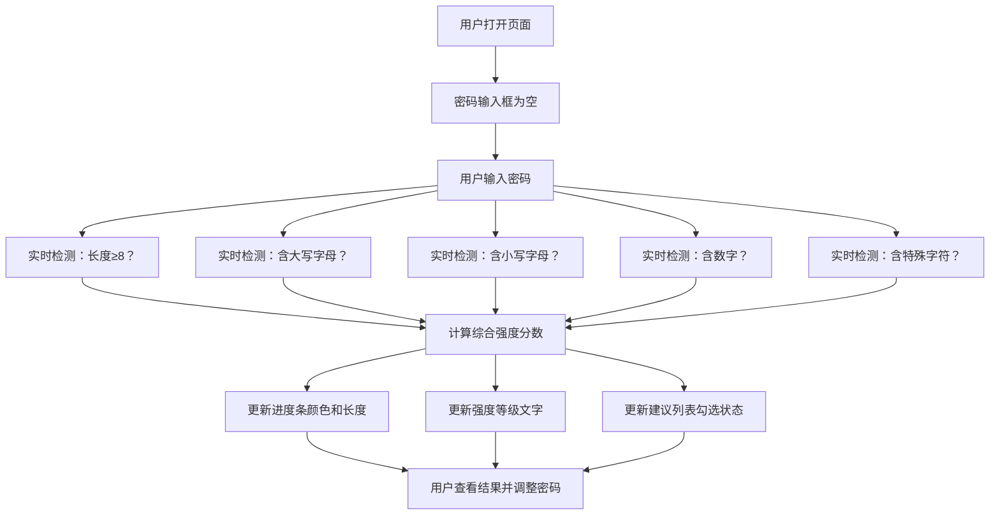

## 1. 产品概述

密码强度检测器是一款帮助用户评估密码安全性的在线工具。用户在输入框中输入密码后，系统会实时检测并以可视化进度条展示密码强度等级，同时提供针对性的改进建议。所有判断均在浏览器本地完成，确保用户隐私安全。

- **核心价值**：帮助用户创建更安全的密码，提升账号安全意识
- **目标用户**：所有需要设置或评估密码强度的互联网用户
- **产品亮点**：实时检测、可视化展示、隐私安全、改进建议

## 2. 核心功能

### 2.1 用户角色
本产品为单页面工具，无需用户注册登录。

### 2.2 功能模块
1. **密码输入模块**：带可见/隐藏切换功能的密码输入框
2. **强度检测模块**：实时分析密码的多个安全维度
3. **进度条展示模块**：动态长度和颜色变化的强度进度条
4. **建议提示模块**：逐条列出密码改进建议

### 2.3 页面详情
| 页面名称 | 模块名称 | 功能描述 |
|-----------|-------------|---------------------|
| 首页 | 密码输入模块 | 支持密码输入、密码可见/隐藏切换 |
| 首页 | 强度进度条 | 实时显示强度百分比，颜色从红色→黄色→绿色渐变 |
| 首页 | 强度等级文字 | 显示"弱"/"中"/"强"等文字标签 |
| 首页 | 改进建议列表 | 逐条列出需要改进的安全建议（已满足的显示勾选状态） |
| 首页 | 隐私提示 | 底部展示"密码不上传、不存储"的隐私保证 |

## 3. 核心流程

用户打开页面 → 在密码输入框中输入密码 → 系统实时检测密码的各个维度（长度、大小写字母、数字、特殊字符等）→ 更新进度条长度和颜色 → 更新强度等级文字 → 更新建议列表的勾选状态 → 用户可随时查看改进建议并调整密码

## 4. 用户界面设计

### 4.1 设计风格
- **主色调**：深色背景（深色模式），配合青蓝色强调色
- **强度颜色**：弱（红色 `#ef4444`）→ 中（黄色 `#eab308`）→ 强（绿色 `#22c55e`）
- **按钮风格**：圆角矩形按钮，带微妙阴影和悬停效果
- **字体**：现代无衬线字体，清晰易读
- **布局风格**：卡片式布局，居中展示，视觉焦点在密码输入和进度条
- **图标风格**：简洁线性图标，使用 Lucide 图标库

### 4.2 页面设计概述
| 页面名称 | 模块名称 | UI 元素 |
|-----------|-------------|-------------|
| 首页 | 标题区 | 大标题"密码强度检测器"，副标题说明用途 |
| 首页 | 密码输入框 | 左侧锁图标，右侧眼睛图标切换可见性，圆角、聚焦状态高亮 |
| 首页 | 进度条区域 | 进度条容器、动态填充条、强度等级文字标签 |
| 首页 | 建议列表 | 每项含勾选图标和建议文字，已满足项颜色淡化加绿色勾选 |
| 首页 | 隐私提示 | 底部小字提示，盾牌图标，强调数据不上传 |

### 4.3 响应式
- 桌面端：最大宽度 500px 的卡片居中展示
- 移动端：宽度自适应屏幕，左右留适当边距
- 输入框和按钮尺寸在移动端保持足够触控区域

## 5. 检测规则说明

密码强度基于以下 5 个维度综合评分：
1. **长度要求**：密码长度 ≥ 8 位（额外奖励：≥ 12 位）
2. **大写字母**：包含 A-Z 至少一个
3. **小写字母**：包含 a-z 至少一个
4. **数字**：包含 0-9 至少一个
5. **特殊字符**：包含 !@#$%^&*()_+-=[]{}|;':",./<>? 等至少一个

强度等级划分：
- 0-1 项满足：弱（红色，≤ 30%）
- 2-3 项满足：中（黄色，30%-70%）
- 4-5 项满足：强（绿色，≥ 70%）
