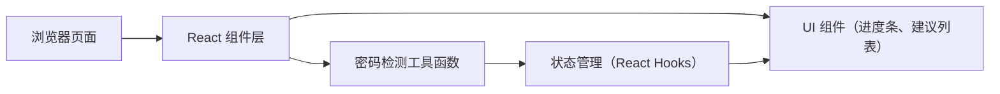

## 1. 架构设计

本项目为纯前端单页应用，无后端服务，所有密码检测逻辑在浏览器端完成。



## 2. 技术描述
- **前端框架**：React@18 + TypeScript
- **构建工具**：Vite
- **样式方案**：TailwindCSS@3
- **状态管理**：React useState Hooks（无需额外状态库）
- **图标库**：lucide-react
- **后端**：无（纯前端应用）
- **初始化方式**：vite-init react-ts 模板

## 3. 路由定义
| 路由 | 用途 |
|-------|---------|
| / | 首页，包含所有功能（单页面应用） |

## 4. API 定义
本项目不涉及后端 API，所有逻辑在前端完成。

## 5. 数据模型

### 5.1 密码检测结果类型
```typescript
interface PasswordCheckResult {
  score: number; // 0-100 分数
  level: 'weak' | 'medium' | 'strong'; // 强度等级
  label: string; // 中文标签：弱/中/强
  color: string; // 对应颜色 hex 值
  checks: PasswordCheckItem[];
}

interface PasswordCheckItem {
  id: string;
  label: string; // 建议文字
  passed: boolean; // 是否已满足
}
```

### 5.2 检测维度配置
- `length`: 密码长度 ≥ 8 位
- `lengthExtra`: 密码长度 ≥ 12 位（加分项）
- `uppercase`: 包含大写字母
- `lowercase`: 包含小写字母
- `number`: 包含数字
- `special`: 包含特殊字符
